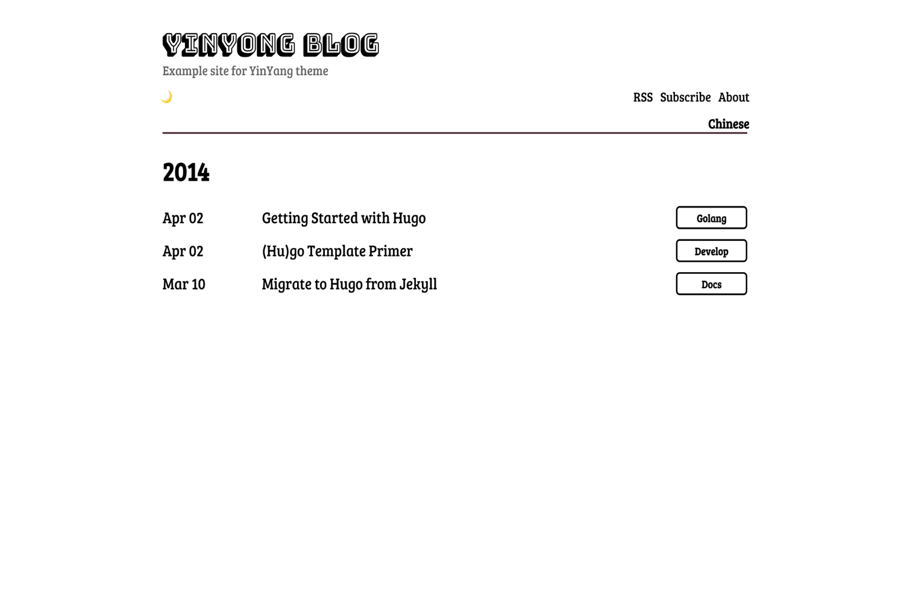

# YinYang

[YinYang](https://en.wikipedia.org/wiki/Yin_and_yang) is a black-white theme for [Hugo](https://gohugo.io/).

[**Demo**](https://blog.joway.io)

## Feature

- minimalist
- multi-language support
- [disqus](https://disqus.com) support
- [SEO Optimization](https://github.com/joway/hugo-theme-yinyang/blob/master/layouts/partials/seo.html)

## Screenshot



## Installation

From the root of your site:

```shell
git submodule add https://github.com/joway/hugo-theme-yinyang.git themes/yinyang
```

Change `config.toml`:

```toml
theme = "yinyang"
```

## Configuration

### Head Title

```
[params]
headTitle = "Joway Wang"
```

If there is no `headTitle` in params, use `.Site.Params.author.name`.

### Main section

Set your main section:

```
[params]
mainSections = ["posts"]
```

### Multi-Language

```
[languages]
  [languages.en]
    contentDir = "content/en"
    languageName = "English"
    weight = 1
  [languages.cn]
    contentDir = "content/cn"
    languageName = "Chinese"
    weight = 2
```

Then your posts files should be put into `content/en` or `content/cn`.

### Footer

```
[[params.socials]]
name = "About Me"
link = "https://joway.io"
[[params.socials]]
name = "Github"
link = "https://github.com/joway"
```

### Extra Head

```
[params]
extraHead = '<script src="xxxx.js"></script>'
```

### Extra CSS files

```
[params]
extraCSSFiles = ["css/foo.css", "css/bar.css"]
```

### Twitter Cards

Add the following setting:

```
[params]
twitterCards = true
```

In a post's front matter, include a keyword `images` with a value of a list of
URLs of images that will be used for Twitter Cards.

### Insert content on every post

```
[params]
postHeaderContent = ""
postFooterContent = "<br/><br/><p>Subscribe：<a target='_blank' href='https://mailchi.mp/a1a0d59e7a19/joway'>Joway's Blog</a></p>"
```

### Example

```
DefaultContentLanguage = "cn"
baseURL = "https://blog.joway.io/"
canonifyURLs = false
enableRobotsTXT = true
languageCode = "en-us"
theme = "yinyang"
title = "Random Thoughts"

# [related]
# includeNewer = true
# threshold = 80
# toLower = false
# [[related.indices]]
# name = "date"
# weight = 100
# [[related.indices]]
# name = "keywords"
# weight = 100

[markup]
[markup.goldmark]
[markup.goldmark.renderer]
unsafe = true
[markup.highlight]
guessSyntax = true
noClasses = false
style = "tango"
tabWidth = 2

[languages]
# [languages.en]
#   contentDir = "content/en"
#   languageName = "English"
#   weight = 1
[languages.cn]
contentDir = "content/cn"
languageName = "简体中文"
weight = 2

[permalinks]
post = "/blog/:title/"

[params]
description = "Log something useless, but interesting." 
disqus = "joway" # disqus account name
extraHead = '<script async src="https://www.googletagmanager.com/gtag/js?id=UA-53624533-8"></script><script src="https://cdn.jsdelivr.net/gh/joway/homepage/analytics.js"></script>' 
favicon = "/logo.png" 
headTitle = "Random Thoughts" 
mainSections = ["posts"] 
postFooterContent = '<br/><br/><p>Subscribe：<a target="_blank" href="https://mailchi.mp/a1a0d59e7a19/joway"><b>Mailchimp</b></a></p><br/><a rel="license" href="http://creativecommons.org/licenses/by-nc-nd/4.0/"></a>' 
postHeaderContent = "" 
staticPrefix = "https://cdn.jsdelivr.net/gh/joway/blog" 
# extraBody = '<script>(adsbygoogle = window.adsbygoogle || []).push({});</script>'
# postAds = '<ins class="adsbygoogle" style="display:block" data-ad-client="ca-pub-6400651395935595" data-ad-slot="5705651853" data-ad-format="auto" data-full-width-responsive="true"></ins>'
lazyImage = true

[params.author]
homepage = "https://joway.io/"
name = "Joway"

# [[params.socials]]
# name = "Telegram"
# link = "https://t.me/biosthinking"

# [[params.socials]]
# name = "RSS"
# link = "/index.xml"

# [[params.socials]]
# name = "Slides"
# link = "/presentations"

[[params.socials]]
link = "https://mailchi.mp/a1a0d59e7a19/joway"
name = "Subscribe"
[[params.socials]]
link = "/travel"
name = "Travel"
[[params.socials]]
link = "https://joway.io"
name = "About"
```
