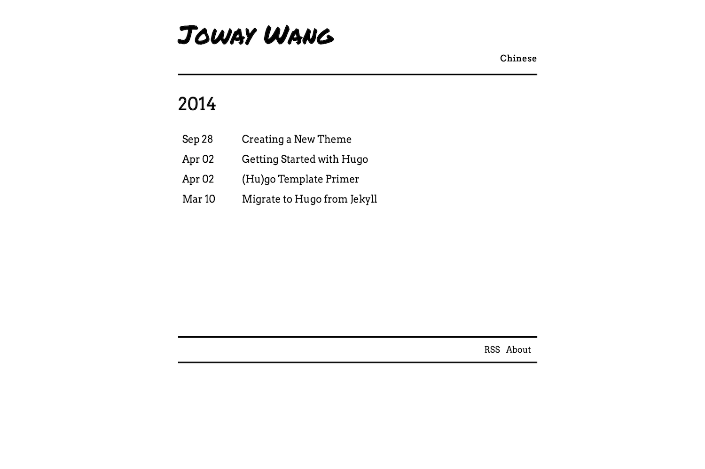

# YinYang

[YinYang](https://en.wikipedia.org/wiki/Yin_and_yang) is a black-white theme for [Hugo](https://gohugo.io/).

[**Demo**](https://blog.joway.io)

## Feature

- minimalist
- multi-language support
- [disqus](https://disqus.com) support
- [SEO Optimization](https://github.com/joway/hugo-theme-yinyang/blob/master/layouts/partials/seo.html)

## Screenshot



## Installation

From the root of your site:

```shell
git clone git@github.com:joway/hugo-theme-yinyang.git themes/yinyang
```

Change `config.toml`:

```toml
theme = "yinyang"
```

## Configuration

### Head Title

```
[params]
headTitle = "Joway Wang"
```

If there is no `headTitle` in params, use `.Site.Author.name`.

### Main section

Set your main section:

```
[params]
mainSections = ["posts"]
```

### Multi-Language

```
[languages]
  [languages.en]
    contentDir = "content/en"
    languageName = "English"
    weight = 1
  [languages.cn]
    contentDir = "content/cn"
    languageName = "Chinese"
    weight = 2
```

Then your posts files should be put into `content/en` or `content/cn`.

### Footer

```
[[params.socials]]
name = "About Me"
link = "https://joway.io"
[[params.socials]]
name = "Github"
link = "https://github.com/joway"
```

### Extra Head

```
[params]
extraHead = '<script src="xxxx.js"></script>'
```

### Example

```
baseURL = "https://blog.joway.io/"
languageCode = "en-us"
title = "Joway's Blog"
theme = "yinyang"
DefaultContentLanguage = "cn"

[author]
  name = "Joway"
  homepage = "https://joway.io/"

[languages]
  [languages.en]
    contentDir = "content/en"
    languageName = "English"
    weight = 1
  [languages.cn]
    contentDir = "content/cn"
    languageName = "Chinese"
    weight = 2

[params]
mainSections = ["posts"]
headTitle = "Joway Wang"
disqus = "joway" # disqus account name
extraHead = '<script async src="https://www.googletagmanager.com/gtag/js?id=UA-xxx"></script>'
[[params.socials]]
name = "About Me"
link = "https://joway.io"
[[params.socials]]
name = "Github"
link = "https://github.com/joway"
```
